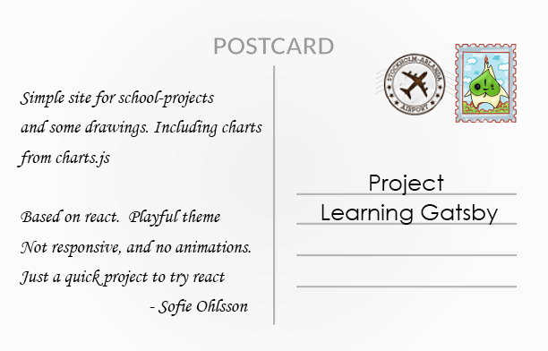

<a href="/portfolio">

	
  

		

	

						
	

		

			

	  

	

						

</a>

<h5 class="solutionLink bl">Change season</h5>

 

<button class="example_f">Autumn</button>

<button class="example_f">Winter</button>

<button class="example_f">Spring</button>

<button class="example_f">Summer</button>

<section id="archives" class="portfolio-container">

</section>

<h2> Hi, I'm Sofie </h2>

I'm a Frontend Developer. I make your business look good   by creating a beautiful website

<section class="portfolio-container">

</section>

<h2>Available for new projects</h2>

Currently awailable for freelance.  Contact me at contact@sofieohlsson.com

<section class="portfolio-container">
    
    
</section>
<h2>Letters from the Archives</h2>

Here is a hand-picked selection of my previous works.   More will come over time

<h2 id="bucketlist">Bucketlist</h2>
Life is unexpected. Make the most of it. Turn you dreams into memories

<section class="container flex-cards page-section bl">

    

        

            

            <figure class="card-header">
            
            

            
{{bl.date}}

            

            </figure>
            

            

                
{{bl.description}}

            

        


</section>