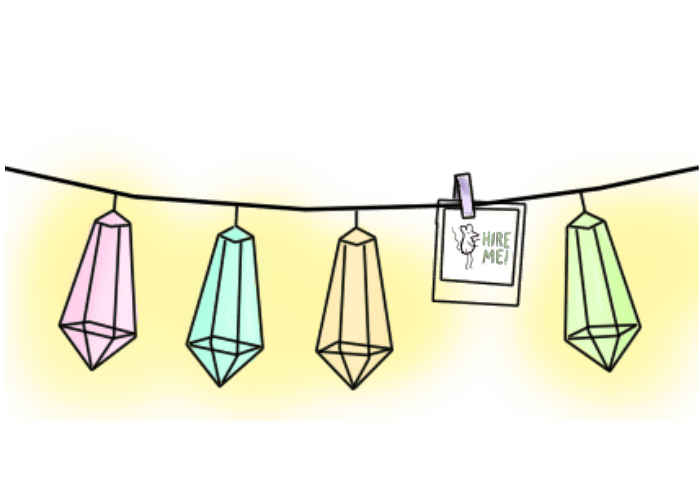

<a href="#sofie">&#8595;</a>

<h1>Sofie Ohlsson</h1>

<main class="pagetwo-content">

<section id="archives" class="portfolio-container">

</section>

<h2 id="sofie">Hi, I'm Sofie </h2>

I'm a Frontend Developer. I make your business look good by creating a beautiful website

<a href="/index">

	
  

		

	

						
	

		

			

	  

	

						

</a>

<section class="portfolio-container">

</section>

<h2>Available for new projects</h2>

Currently awailable for freelance. Contact me at contact@sofieohlsson.com

<h2 id="bucketlist">Bucketlist</h2>

Life is unexpected. Make the most of it. Turn you dreams into memories

</main>

<section class="container flex-cards page-section">

    

        

            <figure class="card-header snip1104">
            
            

                  <figcaption>
    <h2>{{bucketlist.description1}}  {{bucketlist.description2}}</h2>
  </figcaption>
            

            </figure>
        


</section>